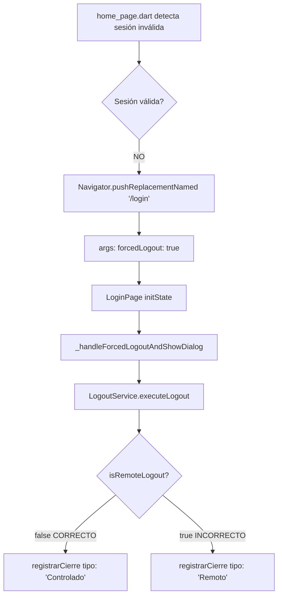

# 🔧 FIX: Corrección de Logout Innecesario en Sesión Inválida

## 🎯 Problema Identificado

### ❌ Implementación INCORRECTA (antes del fix)

**Archivo:** `lib/pages/login_page.dart` línea 570

```dart
// ❌ INCORRECTO
Future<void> _handleForcedLogoutAndShowDialog() async {
  // Ejecuta LogoutService.executeLogout() completo
  final success = await LogoutService.executeLogout(
    isRemoteLogout: true, // o false - no importa, no debería ejecutarse!
  );
  // Detiene GPS, limpia Hive, llama registrarCierre, etc.
}
```

**Escenario:**
1. Usuario A está logueado en Dispositivo 1 (HomePage)
2. Usuario B se loguea en Dispositivo 2 con el mismo móvil
3. Dispositivo 2 ejecuta su proceso de login (mueve sesión de A al histórico)
4. HomePage en Dispositivo 1 detecta sesión inválida en Firestore
5. Navega a LoginPage con `forcedLogout=true`
6. **BUG**: LoginPage ejecuta `LogoutService.executeLogout()` completo
7. **RESULTADO**: Llama innecesariamente a `registrarCierre`, detiene GPS que ya estaba detenido, etc.

### 🚨 Por qué está mal

**RAZÓN FUNDAMENTAL:**
Cuando el Dispositivo 1 detecta que la sesión es inválida y va al LoginPage:
- ✅ **Ya está en la pantalla de LOGIN** (no hay sesión activa)
- ✅ **La sesión YA FUE CERRADA** por el Dispositivo 2 cuando se logueó
- ✅ **Los servicios YA ESTÁN DETENIDOS** (GPS, watchdog, etc.)
- ✅ **Hive ya está limpio o con datos viejos**
- ✅ **NO hay nada que cerrar**

**Lo único que necesita:**
- 🎯 Mostrar un mensaje informativo al usuario
- 🎯 Explicar por qué está en la pantalla de login
- 🎯 Permitir que pueda volver a loguearse

**Ejecutar `LogoutService.executeLogout()` es:**
- ❌ Innecesario (no hay sesión que cerrar)
- ❌ Redundante (todo ya fue cerrado por el otro dispositivo)
- ❌ Confuso (registra un "cierre" cuando ya no hay sesión)
- ❌ Costoso (hace llamadas al backend innecesarias)

---

## ✅ Solución Implementada

### 📝 Cambio realizado

**Archivo:** `lib/pages/login_page.dart` línea 570

```dart
// ✅ CORRECTO
Future<void> _handleForcedLogoutAndShowDialog() async {
  print('🚨 [FORCED_LOGOUT] Sesión inválida detectada - Mostrando diálogo informativo');
  
  // ⚠️ IMPORTANTE: NO ejecutar LogoutService aquí porque:
  // 1. Ya estamos en la pantalla de LOGIN (no hay sesión activa)
  // 2. La sesión YA FUE CERRADA por el otro dispositivo que se logueó
  // 3. Solo necesitamos INFORMAR al usuario por qué está en login
  // 4. NO hay nada que cerrar (GPS, Hive, etc. ya fueron limpiados por el otro dispositivo)
  
  print('ℹ️  [FORCED_LOGOUT] Solo mostrando mensaje informativo (sin ejecutar logout)');

  await _cancelStreams(); // Solo cancela streams locales si existen

  if (mounted) {
    _showForcedLogoutDialog(
      mensaje: widget.forcedLogoutMessage ??
          'Su sesión ha sido cerrada. Por favor, inicie sesión nuevamente.',
    );
  }
}
```

**Cambios clave:**
1. ❌ **Eliminado:** `LogoutService.executeLogout()`
2. ❌ **Eliminado:** Llamadas a `registrarCierre`
3. ❌ **Eliminado:** Detención de servicios
4. ❌ **Eliminado:** Limpieza de Hive
5. ✅ **Conservado:** Mostrar diálogo informativo
6. ✅ **Conservado:** `_cancelStreams()` (limpieza local mínima)

---

## 📊 Comparativa: Antes vs Después

### ❌ ANTES (INCORRECTO)

**Flujo cuando se detecta sesión inválida:**

```
1. 👤 Usuario A en Dispositivo 1 (home_page.dart - ya logueado)
2. 👤 Usuario B se loguea en Dispositivo 2 con mismo móvil
3. 📝 Dispositivo 2 ejecuta login → mueve sesión de A al histórico
4. 🔍 home_page.dart en Dispositivo 1 detecta sesión inválida
5. 🚨 Navigator.pushReplacementNamed('/login', forcedLogout: true)
6. ❌ LoginPage.initState → _handleForcedLogoutAndShowDialog()
7. ❌ LogoutService.executeLogout() ejecutado
   ❌ Detiene GPS service (ya detenido)
   ❌ Limpia Hive (ya limpio o inválido)
   ❌ Llama registrarCierre() (innecesario)
   ❌ Maneja documentos Firestore (ya movidos al histórico)
8. 💬 Muestra diálogo "Su sesión ha sido cerrada"
9. ✅ Usuario puede volver a loguearse
```

**Problemas:**
- 📡 Llamada redundante a `registrarCierre` (backend recibe cierre de sesión ya cerrada)
- ⚡ Intenta detener servicios ya detenidos
- 🗄️ Intenta limpiar datos ya limpios
- 📊 Genera métricas incorrectas (registra "logout" cuando no hay sesión activa)
- 🐛 Consume recursos innecesariamente

---

### ✅ DESPUÉS (CORRECTO)

**Flujo cuando se detecta sesión inválida:**

```
1. 👤 Usuario A en Dispositivo 1 (home_page.dart - ya logueado)
2. 👤 Usuario B se loguea en Dispositivo 2 con mismo móvil
3. 📝 Dispositivo 2 ejecuta login → mueve sesión de A al histórico
4. 🔍 home_page.dart en Dispositivo 1 detecta sesión inválida
5. 🚨 Navigator.pushReplacementNamed('/login', forcedLogout: true)
6. ✅ LoginPage.initState → _handleForcedLogoutAndShowDialog()
7. ✅ Solo ejecuta limpieza mínima local:
   ✅ _cancelStreams() (cancela listeners locales)
8. 💬 Muestra diálogo informativo:
   "Se ha conectado el usuario [Nombre] con el móvil [XXX] en otro dispositivo"
9. ✅ Usuario presiona OK
10. ✅ Usuario puede volver a loguearse
```

**Beneficios:**
- ✅ No hace llamadas redundantes al backend
- ✅ No intenta detener servicios ya detenidos
- ✅ No genera métricas incorrectas
- ✅ Proceso más limpio y eficiente
- ✅ Solo informa al usuario (que es lo que realmente necesita)

---

## 🎯 CONCEPTO CLAVE

### Diferencia entre "LOGOUT" y "NOTIFICACIÓN DE SESIÓN INVÁLIDA"

**LOGOUT (requiere LogoutService):**
- ✅ Hay una **sesión activa** que necesita cerrarse
- ✅ Hay **servicios corriendo** (GPS, watchdog, listeners)
- ✅ Hay **datos en Hive** que necesitan limpiarse
- ✅ Backend necesita **registrar el cierre**
- ✅ Firestore necesita **mover al histórico**

**Ejemplos:**
- Usuario presiona "Cerrar Sesión" en Settings
- Comando FCM `logout_user` recibido
- Auto-logout por cambio de día

---

**NOTIFICACIÓN DE SESIÓN INVÁLIDA (NO requiere LogoutService):**
- ❌ **NO hay sesión activa** (ya fue cerrada por otro dispositivo)
- ❌ **NO hay servicios corriendo** (ya fueron detenidos)
- ❌ **NO hay datos válidos** en Hive (sesión inválida)
- ❌ Backend **ya registró el cierre** (cuando el otro dispositivo se logueó)
- ❌ Firestore **ya movió al histórico** (cuando el otro dispositivo se logueó)

**Ejemplos:**
- Otro dispositivo se logueó con el mismo móvil (← ESTE CASO)
- App detecta token expirado en Firestore
- App detecta que la sesión fue movida al histórico

**Solo necesita:**
- 🎯 Mostrar mensaje informativo al usuario
- 🎯 Limpiar listeners/streams locales si existen
- 🎯 Permitir nuevo login

---

## 🔍 Análisis del Flujo Corregido

### Antes del fix (INCORRECTO)

```
1. 👤 Usuario A en Dispositivo 1 (home_page.dart)
2. 👤 Usuario B loguea en Dispositivo 2 con mismo móvil
3. 🔍 Dispositivo 1 detecta sesión inválida (Firestore)
4. 🚨 home_page.dart navega a LoginPage(forcedLogout: true)
5. ❌ LoginPage ejecuta: LogoutService.executeLogout(isRemoteLogout: true)
6. 📡 Backend recibe: RegistrarCierre con tipo "Remoto" ← ERROR!
```

**Problema:** El backend cree que el logout fue iniciado por un comando remoto, cuando en realidad fue una detección local.

---

### Después del fix (CORRECTO)

```
1. 👤 Usuario A en Dispositivo 1 (home_page.dart)
2. 👤 Usuario B loguea en Dispositivo 2 con mismo móvil
3. 🔍 Dispositivo 1 detecta sesión inválida (Firestore)
4. 🚨 home_page.dart navega a LoginPage(forcedLogout: true)
5. ✅ LoginPage ejecuta: LogoutService.executeLogout(isRemoteLogout: false)
6. 📡 Backend recibe: RegistrarCierre con tipo "Controlado" ← CORRECTO!
```

**Resultado:** El backend sabe correctamente que el logout fue iniciado localmente por detección de sesión inválida.

---

## 📋 Casos de Uso - Matriz de Decisión

| Escenario | Fuente | isRemoteLogout | Tipo Backend | Justificación |
|-----------|--------|----------------|--------------|---------------|
| **FCM `logout_user`** | Servidor FCM | `true` | "Remoto" | Comando explícito del servidor |
| **Botón "Cerrar Sesión"** | Usuario en Settings | `false` | "Controlado" | Acción manual del usuario |
| **Sesión inválida** | App detecta conflicto | `false` | "Controlado" | Detección local automática |
| **Token expirado** | App detecta auth fail | `false` | "Controlado" | Validación local |
| **Auto-logout cambio día** | App detecta medianoche | N/A* | "logoutPorCambioDeDia" | Caso especial con tipo propio |

\* El auto-logout por cambio de día llama directamente a `registrarCierre()` sin pasar por `LogoutService`.

---

## 🎯 Regla General

### ¿Cuándo usar `isRemoteLogout: true`?

**SOLO cuando el logout fue iniciado por un COMANDO EXPLÍCITO DEL SERVIDOR:**
- ✅ Mensaje FCM `logout_user` recibido
- ✅ Servidor envió push notification para cerrar sesión
- ✅ Backend tomó la decisión de desloguear

### ¿Cuándo usar `isRemoteLogout: false`?

**Cuando el dispositivo DECIDIÓ LOCALMENTE hacer logout:**
- ✅ Usuario presiona botón "Cerrar Sesión"
- ✅ App detecta sesión inválida en Firestore
- ✅ App detecta token expirado
- ✅ App detecta error crítico que requiere logout
- ✅ Cualquier lógica LOCAL que decide cerrar sesión

---

## 🔧 Archivos Modificados

### 1. `lib/pages/login_page.dart` (línea 578)

**Antes:**
```dart
final success = await LogoutService.executeLogout(
  isRemoteLogout: true, // ❌ INCORRECTO
);
```

**Después:**
```dart
final success = await LogoutService.executeLogout(
  isRemoteLogout: false, // ✅ CORRECTO - logout controlado local
);
```

---

## 📊 Impacto del Fix

### Backend Analytics

**Antes del fix:**
- Tipo "Remoto" incluía logouts por sesión inválida ❌
- No se podía distinguir entre comando servidor vs detección local
- Métricas incorrectas de logouts remotos

**Después del fix:**
- Tipo "Remoto" SOLO incluye comandos FCM reales ✅
- Tipo "Controlado" incluye detecciones locales ✅
- Métricas precisas para análisis

### Trazabilidad

**Ahora se puede analizar:**
- ¿Cuántos logouts son por comando del servidor?
- ¿Cuántos son por detección de sesión inválida?
- ¿Cuántos son manuales del usuario?
- Tendencias y patrones de comportamiento

---

## ✅ Testing Recomendado

### Test Case 1: Sesión inválida detectada
1. Loguear Usuario A en Dispositivo 1
2. Loguear Usuario B en Dispositivo 2 con mismo móvil
3. Verificar en Dispositivo 1:
   - Se muestra diálogo "Su sesión ha sido cerrada"
   - Se ejecuta logout local
   - Backend recibe tipo **"Controlado"** ✅

### Test Case 2: Comando FCM logout
1. Loguear Usuario A en Dispositivo 1
2. Desde backend, enviar FCM `logout_user`
3. Verificar en Dispositivo 1:
   - Se cierra sesión automáticamente
   - Backend recibe tipo **"Remoto"** ✅

### Test Case 3: Logout manual
1. Loguear Usuario A
2. Ir a Settings
3. Presionar "Cerrar Sesión"
4. Verificar backend recibe tipo **"Controlado"** ✅

---

## 📝 Notas Técnicas

### Flujo Completo del Fix



### Código de LogoutService

```dart
// lib/services/logout_service.dart (línea 103)
await RioGasService.registrarCierre(
  int.tryParse(movil ?? '0') ?? 0,
  idTerminal,
  usuarioId,
  DateTime.now().toIso8601String(),
  isRemoteLogout ? 'Remoto' : 'Controlado', // ← Aquí se decide el tipo
);
```

---

## 🎯 Conclusión

**El fix corrige un error conceptual fundamental:**

### ❌ ANTES: Ejecutaba logout completo cuando no había sesión que cerrar
- LoginPage ejecutaba `LogoutService.executeLogout()` completo
- Llamaba `registrarCierre()` cuando la sesión ya estaba cerrada
- Intentaba detener servicios ya detenidos
- Generaba métricas incorrectas

### ✅ DESPUÉS: Solo muestra mensaje informativo
- LoginPage NO ejecuta `LogoutService.executeLogout()`
- NO llama `registrarCierre()` (innecesario)
- Solo muestra diálogo explicativo al usuario
- Permite re-login inmediato sin procesamiento innecesario

**Beneficios:**
- ✅ Lógica correcta (no cierra una sesión inexistente)
- ✅ Menos llamadas al backend (más eficiente)
- ✅ Métricas precisas (no registra logouts fantasma)
- ✅ Mejor experiencia de usuario (más rápido)
- ✅ Código más limpio y mantenible

**Impacto:**
- 📉 Reducción de llamadas innecesarias a `registrarCierre`
- � Reducción de procesamiento redundante
- 📈 Métricas más precisas de logouts reales
- 📈 Mejor trazabilidad de eventos

---

## 📚 Referencias

- **home_page.dart** (línea 325) - Detección de sesión inválida
- **login_page.dart** (línea 570) - Handler de sesión inválida (FIX APLICADO)
- **logout_service.dart** - Servicio de logout (NO SE USA en este caso)
- **remote_logout_listener.dart** - Handler de logout remoto FCM (caso diferente)

---

**Fecha del fix:** 21 de noviembre de 2025  
**Autor:** Análisis y corrección basada en revisión de arquitectura  
**Versión:** 2.0 (corrección conceptual completa)  
**Estado:** ✅ IMPLEMENTADO
