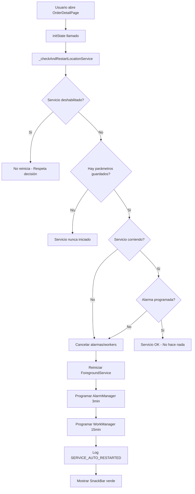

# 🔄 Sistema de Auto-Reinicio del Servicio de Coordenadas

## 📋 Descripción General

Este sistema verifica automáticamente si el servicio de coordenadas GPS está activo cuando el usuario accede a la pantalla de detalle de un pedido. Si el servicio está muerto (porque Android lo mató, la batería lo detuvo, etc.), lo reinicia automáticamente **sin duplicar alarmas ni workers**.

---

## 🎯 Objetivo

**Problema**: El servicio de coordenadas puede morir por varias razones:
- Android mata la app por optimización de batería
- El usuario limpia la memoria
- Fallos del sistema
- Restricciones de Android 12+ en servicios background

**Solución**: Verificar y reiniciar automáticamente el servicio cuando el usuario entra a la pantalla de detalle del pedido.

---

## 🏗️ Arquitectura

### 1️⃣ Kotlin - MainActivity.kt

#### Método: `checkAndRestartLocationService`

```kotlin
"checkAndRestartLocationService" -> {
    // 1. Verificar si el servicio está deshabilitado manualmente
    val isDisabled = prefs.getBoolean("service_disabled", false)
    
    // 2. Obtener parámetros guardados (movil, escenario, usuario, etc.)
    val movil = prefs.getString("last_movil", null)
    
    // 3. Verificar si hay alarmas programadas
    val pendingIntent = PendingIntent.getBroadcast(
        this, 1710, intent, 
        PendingIntent.FLAG_NO_CREATE or PendingIntent.FLAG_IMMUTABLE
    )
    
    // 4. Verificar si el ForegroundService está corriendo
    val isServiceRunning = isServiceRunning(ForegroundLocationService::class.java)
    val hasAlarmScheduled = (pendingIntent != null)
    
    // 5. Si el servicio NO está corriendo O NO hay alarma, reiniciar
    if (!isServiceRunning || !hasAlarmScheduled) {
        // Cancelar alarmas/workers existentes para evitar duplicados
        alarmManager.cancel(pendingIntent)
        WorkManagerHelper.cancelPeriodicWork(this)
        
        // Reiniciar ForegroundService desde foreground
        startForegroundService(serviceIntent)
        
        // Log del evento de reinicio
        LocationLogger.logEvent(this, "SERVICE_AUTO_RESTARTED", ...)
        
        result.success(mapOf(
            "status" to "restarted",
            "restarted" to true
        ))
    }
}
```

#### Método Helper: `isServiceRunning`

```kotlin
private fun isServiceRunning(serviceClass: Class<*>): Boolean {
    val manager = getSystemService(Context.ACTIVITY_SERVICE) as ActivityManager
    for (service in manager.getRunningServices(Integer.MAX_VALUE)) {
        if (serviceClass.name == service.service.className) {
            return true
        }
    }
    return false
}
```

---

### 2️⃣ Flutter - order_detail_page.dart

#### En `initState()`:

```dart
void initState() {
    super.initState();
    
    // Verificar y reiniciar servicio de coordenadas si está muerto
    _checkAndRestartLocationService();
    
    // ... resto del código ...
}
```

#### Método: `_checkAndRestartLocationService`

```dart
Future<void> _checkAndRestartLocationService() async {
    const tag = '🔄[SERVICE_CHECK]';
    try {
        print('$tag Verificando estado del servicio de ubicación...');

        const platform = MethodChannel('background_service');
        final result = await platform.invokeMethod('checkAndRestartLocationService');

        if (result is Map) {
            final status = result['status'];
            final restarted = result['restarted'] ?? false;

            if (restarted == true) {
                print('$tag ✅ Servicio reiniciado automáticamente');
                
                // Mostrar SnackBar al usuario
                ScaffoldMessenger.of(context).showSnackBar(
                    SnackBar(
                        content: Text('Servicio de ubicación reiniciado'),
                        backgroundColor: Colors.green,
                    ),
                );
            }
        }
    } catch (e) {
        print('$tag ❌ Error verificando servicio: $e');
    }
}
```

---

## 🔍 Estados Posibles

El método puede devolver los siguientes estados:

| Estado | Descripción | Acción |
|--------|-------------|--------|
| **`active`** | Servicio corriendo correctamente | ✅ No hace nada |
| **`restarted`** | Servicio estaba muerto y fue reiniciado | ✅ Muestra SnackBar verde |
| **`disabled`** | Usuario detuvo el servicio manualmente | ⚠️ No reinicia (respeta decisión del usuario) |
| **`never_started`** | Servicio nunca fue iniciado | ⚠️ Usuario debe iniciarlo desde configuración |

---

## 🛡️ Prevención de Duplicados

### ❌ Problema Potencial:
Si el servicio se reinicia múltiples veces sin verificar, podríamos tener:
- Múltiples alarmas programadas
- Múltiples workers en cola
- Envíos duplicados de coordenadas

### ✅ Solución Implementada:

**1. Cancelación de Alarmas Antiguas:**
```kotlin
// FLAG_NO_CREATE: No crea nueva si no existe
val pendingIntent = PendingIntent.getBroadcast(
    this, 1710, intent, 
    PendingIntent.FLAG_NO_CREATE or PendingIntent.FLAG_IMMUTABLE
)

// Si existe, la cancelamos antes de crear una nueva
if (hasAlarmScheduled) {
    alarmManager.cancel(pendingIntent)
}
```

**2. Cancelación de WorkManager:**
```kotlin
// Cancela cualquier trabajo periódico existente
WorkManagerHelper.cancelPeriodicWork(this)
```

**3. Verificación del Estado del Servicio:**
```kotlin
// Usa ActivityManager para verificar si el servicio realmente está corriendo
val isServiceRunning = isServiceRunning(ForegroundLocationService::class.java)
```

---

## 📊 Flujo de Ejecución



---

## 🎯 Casos de Uso

### ✅ Caso 1: Servicio Muerto por Android
**Escenario**: Android mata la app después de 2 horas de inactividad

**Comportamiento**:
1. Usuario abre un pedido
2. Sistema detecta que el servicio no está corriendo
3. Cancela alarmas/workers antiguos
4. Reinicia el servicio con los mismos parámetros
5. Muestra SnackBar: "Servicio de ubicación reiniciado"
6. Servicio vuelve a enviar coordenadas cada 3 minutos

---

### ✅ Caso 2: Alarma Cancelada pero Servicio Vivo
**Escenario**: AlarmManager fue cancelado por el sistema pero el servicio sigue vivo

**Comportamiento**:
1. Sistema detecta que `pendingIntent == null`
2. Cancela cualquier residuo
3. Reprograma AlarmManager + WorkManager
4. Mantiene el servicio vivo
5. Muestra SnackBar de reinicio

---

### ✅ Caso 3: Servicio Activo y Funcionando
**Escenario**: Todo está correcto

**Comportamiento**:
1. Sistema verifica: `isServiceRunning = true` y `hasAlarmScheduled = true`
2. No hace nada
3. No muestra SnackBar
4. Log: "✅ Servicio activo y funcionando correctamente"

---

### ⚠️ Caso 4: Usuario Detuvo el Servicio Manualmente
**Escenario**: Usuario detuvo el servicio desde configuración

**Comportamiento**:
1. Sistema detecta `service_disabled = true`
2. **NO reinicia** (respeta la decisión del usuario)
3. Log: "⚠️ Servicio deshabilitado manualmente, no se reinicia"
4. Usuario debe iniciarlo manualmente desde configuración

---

### ⚠️ Caso 5: Servicio Nunca Iniciado
**Escenario**: Usuario nunca activó el servicio después de login

**Comportamiento**:
1. Sistema detecta `last_movil = null`
2. No puede reiniciar (no hay parámetros)
3. Log: "⚠️ Servicio nunca iniciado, usuario debe activarlo manualmente"
4. Usuario debe ir a configuración e iniciarlo

---

## 📍 ¿Por Qué en `order_detail_page.dart`?

### ❌ Problema con `pending_orders.dart`:

Cuando se descargan múltiples pedidos simultáneamente (ej. 10 pedidos):
```dart
verificarSoloDescargaPedidos() {
    _checkAndRestartLocationService();  // ❌ Se llamaría 10 veces
    
    for (pedido in pedidos) {
        descargarPedido(pedido);
    }
}
```

**Resultado**: 10 llamadas innecesarias al sistema, posibles race conditions.

---

### ✅ Solución con `order_detail_page.dart`:

```dart
initState() {
    _checkAndRestartLocationService();  // ✅ Se llama 1 sola vez
}
```

**Ventajas**:
- Se ejecuta solo cuando el usuario **realmente** va a trabajar con el pedido
- Evita llamadas múltiples innecesarias
- Momento perfecto para verificar antes de cumplir el pedido
- No afecta el rendimiento de la descarga masiva

---

## 🔒 Seguridad y Robustez

### 1. **Try-Catch en Flutter**
```dart
try {
    await platform.invokeMethod('checkAndRestartLocationService');
} catch (e) {
    print('❌ Error verificando servicio: $e');
    // No bloquea la pantalla, solo registra el error
}
```

### 2. **Try-Catch en Kotlin**
```kotlin
try {
    // Verificación y reinicio
    result.success(...)
} catch (e: Exception) {
    Log.e("MainActivity", "❌ Error: ${e.message}", e)
    result.error("ERROR", "Error al verificar servicio: ${e.message}", null)
}
```

### 3. **Prevención de Race Conditions**
- Usa `FLAG_NO_CREATE` para verificar si la alarma existe
- Cancela explícitamente antes de crear nuevas
- Verifica el estado real del servicio con `ActivityManager`

---

## 📝 Logs de Ejemplo

### ✅ Servicio Reiniciado:
```
🔄[SERVICE_CHECK] Verificando estado del servicio de ubicación...
📊 Estado: ServiceRunning=false, AlarmScheduled=false
⚠️ Servicio muerto o alarma cancelada, reiniciando...
🧹 Alarma anterior cancelada
🧹 WorkManager anterior cancelado
✅ Servicio reiniciado automáticamente - Sistema híbrido reactivado
📊 EVENT_LOG: SERVICE_AUTO_RESTARTED
  - usuario: 49618553
  - deviceId: b00a68bef3451313
  - movil: 693
  - interval: 3
  - reason: Service was dead or alarm was cancelled
  - wasServiceRunning: false
  - hadAlarmScheduled: false
🔄[SERVICE_CHECK] Estado: restarted - Servicio reiniciado automáticamente
🔄[SERVICE_CHECK] ✅ Servicio reiniciado automáticamente
```

### ✅ Servicio Activo:
```
🔄[SERVICE_CHECK] Verificando estado del servicio de ubicación...
📊 Estado: ServiceRunning=true, AlarmScheduled=true
✅ Servicio activo y funcionando correctamente
🔄[SERVICE_CHECK] Estado: active - Servicio activo y funcionando
🔄[SERVICE_CHECK] ✅ Servicio activo y funcionando correctamente
```

### ⚠️ Servicio Deshabilitado:
```
🔄[SERVICE_CHECK] Verificando estado del servicio de ubicación...
⚠️ Servicio deshabilitado manualmente, no se reiniciará automáticamente
🔄[SERVICE_CHECK] Estado: disabled - Servicio deshabilitado manualmente
🔄[SERVICE_CHECK] ⚠️ Servicio deshabilitado manualmente, no se reinicia
```

---

## ✅ Resumen

Este sistema garantiza que:

1. ✅ El servicio de coordenadas esté **siempre activo** cuando el usuario trabaja con pedidos
2. ✅ **No hay duplicados** de alarmas o workers
3. ✅ **Respeta la decisión del usuario** si detuvo el servicio manualmente
4. ✅ Se ejecuta **eficientemente** (1 vez por acceso a pedido, no 10 veces en descargas masivas)
5. ✅ **Registra todo** en logs para debugging
6. ✅ **Muestra feedback visual** al usuario cuando reinicia el servicio
7. ✅ **No bloquea la UI** si hay errores
8. ✅ **Compatible con Android 12+** (inicia servicio desde foreground)

---

## 🔧 Mantenimiento

Si necesitas modificar el comportamiento:

1. **Cambiar el intervalo de verificación**: Edita los parámetros en `MainActivity.kt`
2. **Modificar el mensaje al usuario**: Edita el SnackBar en `order_detail_page.dart`
3. **Agregar verificación en otra pantalla**: Copia el método `_checkAndRestartLocationService()`
4. **Ajustar logs**: Modifica los `print()` y `Log.d()` según necesites

---

**Fecha de creación**: 16 de Octubre de 2025
**Autor**: Sistema de Auto-Reinicio Inteligente
**Versión**: 1.0.0
